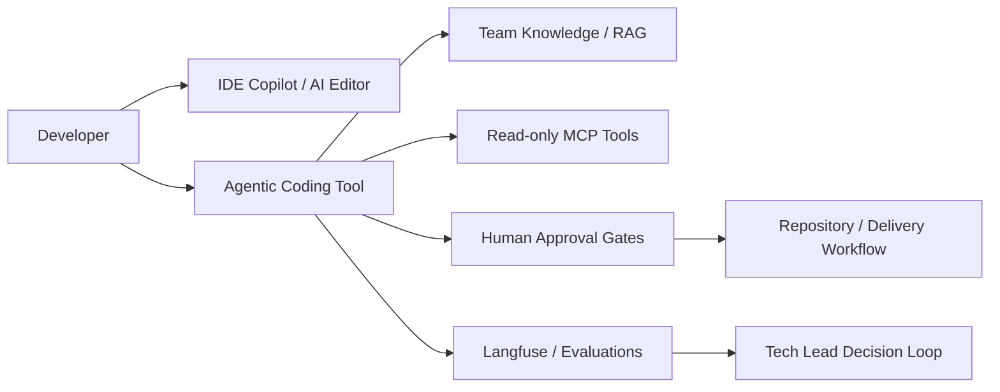
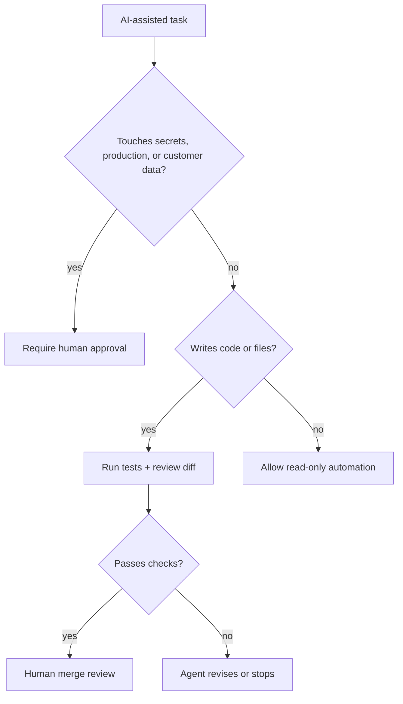
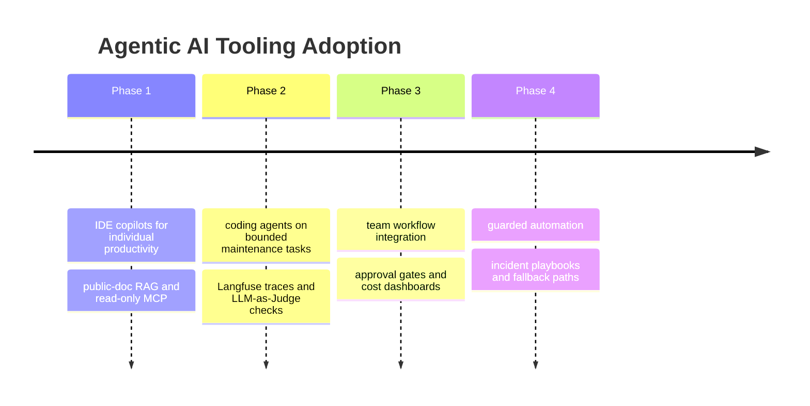

# Agentic AI Developer Tools Market Analysis for a Small Anonymous AEC/Manufacturing Software Team

## Executive Summary
The market has split into four practical layers for a small software team: (1) IDE copilots for low-friction productivity, (2) coding agents for scoped implementation and refactors, (3) observability/evaluation platforms to make agent behavior auditable and improvable, and (4) MCP-style integrations to connect assistants to internal docs and tools. For a small AEC/manufacturing team, the safest adoption path is staged: start with one IDE copilot pilot for the full team or a small subset, add one coding agent for narrow high-leverage tasks, then instrument traces/evals before any write-capable automation, and only then introduce read-only MCP connectors to internal knowledge and issue systems. Public evidence shows these tools are moving quickly toward “software factory” workflows, but the main constraint for small teams is not model quality—it is total cost of ownership: seats, token/API spend, observability bills, and the engineering time needed to wire tools together and keep them safe.

Practical recommendation: adopt a Copilot-style baseline first if the goal is broad day-to-day productivity; add Claude Code or Codex-style agents only for specific repos and tasks with human review; use Langfuse/LangSmith/Braintrust only once the team needs trace-level debugging and evaluation loops; use MCP only as a read-only integration boundary at first. The default policy should be human approval for all write-side actions until the team has measured acceptance rate, rework, and spend for at least one pilot cycle.

## Market Segments
- **IDE copilots:** Inline coding assistance inside editors for autocomplete, chat, code explanation, test generation, and small refactors. Best for broad seat coverage and low process change. Adoption signal: Strongest first-step adoption for small teams because it spreads quickly, has the lowest workflow disruption, and is easiest to roll back by turning seats off.
- **Coding agents:** More autonomous tools that can plan changes, modify multiple files, run tests, and sometimes open or prepare pull requests. Better for scoped implementation work, migrations, and repetitive refactors. Adoption signal: Growing fast for teams that want multi-file changes or PR automation, but requires tighter controls, more review, and clearer budget discipline than copilots.
- **Observability and evaluation platforms:** Tracing, prompt/version management, dataset review, experiments, and LLM-as-a-judge evaluation to understand why agentic workflows succeeded or failed. Adoption signal: Becomes necessary once agents affect shared code or operational decisions; adoption rises with multi-step workflows and regulated or high-reliability use cases.
- **MCP-based integrations:** Standardized connectors that let agents access internal docs, ticketing, repositories, and other tools through a common protocol. Adoption signal: High long-term leverage, but the blast radius is real; small teams should start read-only and only expand to write access after proving governance and rollback procedures.

## Tool Assessments
### GitHub Copilot
- Category: IDE copilot
- Strengths: Low-friction editor integration and broad familiarity across development teams.; Good entry point for routine code completion, boilerplate, tests, and small refactors.; Seat-based pricing is simpler to forecast than pure usage-based agent billing.
- Limitations: Less autonomous than full coding agents for multi-file changes and task completion.; Value depends on team habits; underuse can make seat spend inefficient.; Not enough by itself for end-to-end observability or tool integration.
- Fit: Best first adoption for a small team that wants immediate productivity gains without changing delivery process. Use as the baseline layer for everyday coding, then measure acceptance rate and cycle-time impact before adding more autonomous tooling.
### Cursor
- Category: IDE copilot / agentic IDE
- Strengths: Combines familiar editor workflow with more agent-like multi-file editing.; Useful for local repository context and iterative refactors.; Often positioned as a strong developer-workflow tool for teams that want a single environment for editing and guided automation.
- Limitations: Can encourage deeper vendor coupling if the team adopts project-specific workflows inside the IDE.; More autonomy can raise review burden and create larger accidental-change surfaces.; Pricing and usage costs can be harder to model than pure seat-only tools depending on plan and behavior.
- Fit: Good candidate for a small pilot on one repo with high refactor density. It is attractive where models need to work across many files, but it should be limited to a small group until the team has measured accepted-change rate and rework.
### Claude Code
- Category: Coding agent
- Strengths: Strong fit for task-oriented, multi-step coding work such as feature scaffolding, bug fixing, and refactors.; Agentic workflow is well suited to repository-wide changes when paired with human review.; Anthropic has published MCP-related ecosystem guidance, which helps with integrations.
- Limitations: More autonomous behavior increases the need for branch protection and explicit approval gates.; Token/API usage can turn into variable spend that is harder to predict than seat-based copilots.; Best value depends on task scoping and tests; without tests, confidence drops quickly.
- Fit: Best used as a narrow pilot for one or two well-defined repos where the team already has good test coverage and PR discipline. Treat it as a productivity amplifier for bounded tasks, not a general-purpose autonomous engineer.
### OpenAI Codex
- Category: Coding agent
- Strengths: Positioned as an AI coding partner for routine pull requests, feature work, refactors, and migrations.; OpenAI documents MCP support, which makes integration with external tools and docs more practical.; Good fit for teams that want to connect coding assistance to broader tool ecosystems.
- Limitations: More capability can mean more integration and governance overhead.; Usage-based costs require active monitoring.; As with other agents, safety depends on repo scope, tests, and human approval for writes.
- Fit: A strong candidate for a controlled pilot if the team wants a coding agent plus ecosystem integration. Use it where the repo has stable tests and where changes can be checked by a human before merge.
### Kiro
- Category: Agentic development environment
- Strengths: Emphasizes executable specs and moving from prototype to production.; Appeals to teams that want more structure around agentic development.; Can fit teams that prefer an explicit spec-driven workflow.
- Limitations: Less proven in the evidence bundle than Copilot/Cursor/Claude Code/Codex.; Requires the team to adapt process around spec discipline.; Still needs the same controls around review, spend, and integration risk.
- Fit: Interesting but lower-confidence choice for a small team. Consider only after the team knows what workflow gaps it wants to solve, especially if spec-driven development is already part of the culture.
### Langfuse
- Category: Observability and evaluation platform
- Strengths: Open-source LLM engineering platform for tracing, prompt management, datasets, experiments, and LLM-as-a-Judge evaluation.; Good control plane for understanding what an agent saw, what tools it called, token spend, and failure points.; Exportability and self-hosting can reduce vendor lock-in concerns compared with fully closed systems.
- Limitations: Adds a second bill in the form of storage, tracing, and evaluation usage, plus engineering time to instrument systems.; Evaluation quality still depends on the team designing useful datasets and judges.; Another operational layer to maintain if the team is small.
- Fit: A good choice once the first agent pilot touches shared code or business-relevant workflows. Use it to make agent behavior auditable before allowing broader autonomy, but budget for implementation hours and ongoing maintenance.
### LangSmith
- Category: Observability and evaluation platform
- Strengths: Known in the market for tracing and evaluation around LLM applications.; Useful where teams want a managed workflow for experiments, feedback, and traces.; Pairs well with structured agent testing.
- Limitations: Can become expensive at scale if traces and datasets grow quickly.; Like all observability tools, it introduces another platform to operate and migrate.; Teams should verify export and retention behavior before deep adoption.
- Fit: Reasonable if the team already uses LangChain-adjacent workflows or wants a managed observability layer. For a small team, it should be introduced only after there is a concrete evaluation need, not merely because it is fashionable.
### Braintrust
- Category: Observability and evaluation platform
- Strengths: Strong evaluation-oriented framing for complex reasoning and multi-step workflows.; Useful for pairwise comparisons, human review loops, and more formal experiment tracking.; Appears in market comparisons as a serious evaluation option.
- Limitations: Can be more than a small team needs at the outset.; Requires a meaningful amount of instrumented traffic to justify the overhead.; Must be paired with disciplined prompt/version management to be valuable.
- Fit: Best as a later-stage evaluation layer if the team starts using agents for multi-step workflows and needs stronger comparative testing. Not the first platform to buy unless evaluation is already a known pain point.
### Model Context Protocol (MCP)
- Category: Integration protocol
- Strengths: Standardizes how AI tools connect to external data sources and tools.; Supported across a growing ecosystem of IDEs and developer tools.; Good boundary for connecting assistants to docs, issue trackers, and search in a reusable way.
- Limitations: Server lifecycle and debugging add overhead.; Read/write access must be tightly controlled because the blast radius can be large.; If the MCP layer is down, agents may lose access to critical context.
- Fit: High-value but should start as read-only infrastructure for docs, issue metadata, and internal knowledge. Avoid write-capable MCP until the team has traceability, approval flow, and rollback procedures in place.

## Expert Critic Panel
- **Financial Critic:** APPROVED, score 0.84. Add a simple pilot budget model with separate caps for seats, usage, observability, and integration labor, plus a stop/go threshold after the first cycle.; Define measurable ROI gates such as accepted-change rate, reviewer minutes saved, rework rate, and monthly spend per active developer before expanding seats.
- **Risk Manager:** APPROVED, score 0.87. Add a pilot scorecard with explicit go/no-go thresholds: e.g., minimum acceptance rate, maximum rework, max spend per repo, and rollback triggers before expanding scope.; Define a formal write-control policy: human approval required for all PR creation/merge, restricted repo access, branch protection, and named approvers for sensitive systems.
- **Disaster/Resilience Critic:** NEEDS_REVISION, score 0.78. Add a one-page resilience runbook covering provider outage, MCP outage, observability outage, and partial-degradation modes, with explicit owner and escalation paths.; Define manual fallback paths for core workflows: local IDE + git + issue tracker + cached docs + human code review, with a stated process for continuing work without any agent services.

## Adoption Recommendations
- Use Copilot or Cursor as a team baseline to improve code completion, test generation, and review quality quickly.
- Use Claude Code or Codex for narrowly scoped tasks like migration work, repetitive file edits, and bugfix PR preparation.
- Build evaluation discipline early so the team can compare agent behavior on accepted-change rate, review time, and defect leakage.
- Use MCP to connect coding assistants to internal documentation, issue trackers, and design references without bespoke point-to-point glue.
- Create a reusable governance pattern—read-only by default, human approval for writes, exportable traces, and rollbackable connectors—that can scale to future tools.

## Risks And Controls
- Usage-based spend can outgrow the value of the tool if adoption is low or prompts are inefficient.
- Vendor lock-in is real if the team stores prompts, traces, datasets, and workflows in proprietary formats without export planning.
- Write-side agent errors can affect shared code or business systems if approval gates are too loose.
- MCP increases blast radius because a connector can expose sensitive project or operational data to an agent.
- Tool sprawl is a particular danger for small teams: too many overlapping copilots, agents, and observability platforms can create more overhead than value.
- Observability itself can become a second cost center if tracing and evaluation traffic scale faster than the team’s ability to use the data.
- If model providers or MCP servers are unavailable, productivity can drop unless there is a clear manual fallback process.

## Mermaid Decision Diagrams

### Architecture Integration Map

### Risk Decision Flow

### Adoption Roadmap

## Sources
- GitHub Copilot pricing: https://github.com/pricing - Public seat-based pricing is the baseline for budgeting IDE copilots and comparing with usage-heavy tools.
- GitHub Copilot documentation: https://docs.github.com/en/copilot - Documents Copilot capabilities and helps assess fit, workflow integration, and enterprise controls.
- Cursor pricing: https://cursor.com/pricing - Useful for comparing seat-based or hybrid pricing against Copilot and agentic workflows.
- Claude Code documentation: https://docs.anthropic.com/en/docs/claude-code - Primary vendor documentation for coding-agent workflow and usage considerations.
- OpenAI Codex: https://openai.com/codex - Shows the product positioning for code-oriented agentic assistance and PR/refactor workflows.
- OpenAI Developers: Codex MCP: https://developers.openai.com/codex/mcp - Evidence that MCP integrations are a supported part of the Codex ecosystem.
- Anthropic: Introducing the Model Context Protocol: https://www.anthropic.com/news/model-context-protocol - Shows MCP as a real ecosystem standard adopted by developer tools vendors.
- Model Context Protocol intro: https://modelcontextprotocol.io/docs/getting-started/intro - Defines MCP’s purpose and is the cleanest public explanation of the protocol.
- Model Context Protocol GitHub organization: https://github.com/modelcontextprotocol - Shows the open protocol ecosystem and public tooling around MCP.
- Langfuse docs: https://langfuse.com/docs - Primary source for tracing, prompt management, datasets, experiments, and evaluation features.
- Langfuse observability overview: https://langfuse.com/docs/observability/overview - Useful for understanding how Langfuse frames observability for LLM apps and agents.
- Braintrust best LLM evaluation platforms article: https://www.braintrust.dev/articles/best-llm-evaluation-platforms-2025 - Public comparison source for evaluation platform positioning and multi-step reasoning evaluation.
- Artificial Analysis: Coding Agents Comparison: https://artificialanalysis.ai/agents/coding - Independent comparison context across coding agents and IDE-native tools.
- Kiro: Agentic AI development from prototype to production: https://kiro.dev/ - Represents the spec-driven, agentic development environment segment.
- public_agentic_dev_tools_notes.md: local knowledge source - Contains public-source notes synthesized for this course project, including Copilot, Codex, Langfuse, and MCP adoption guidance.

## Methodology
The system combined public web search, local RAG notes, expert critic routing, human-approved criteria, and a revision loop before compiling this decision package.