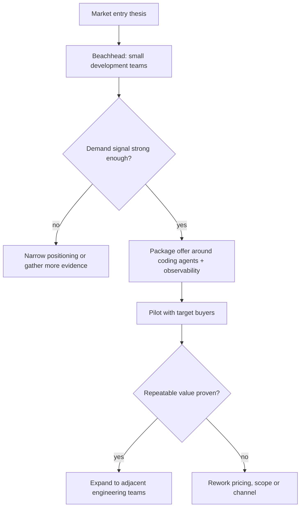
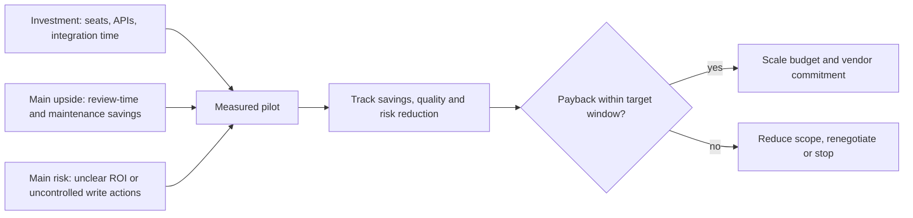
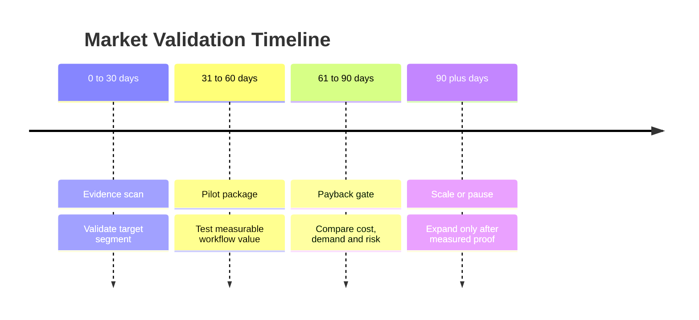
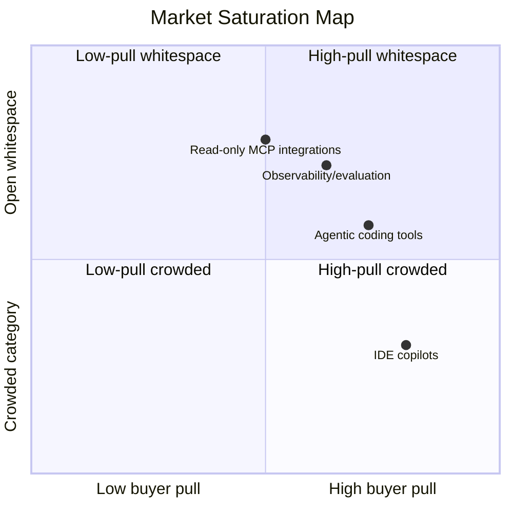
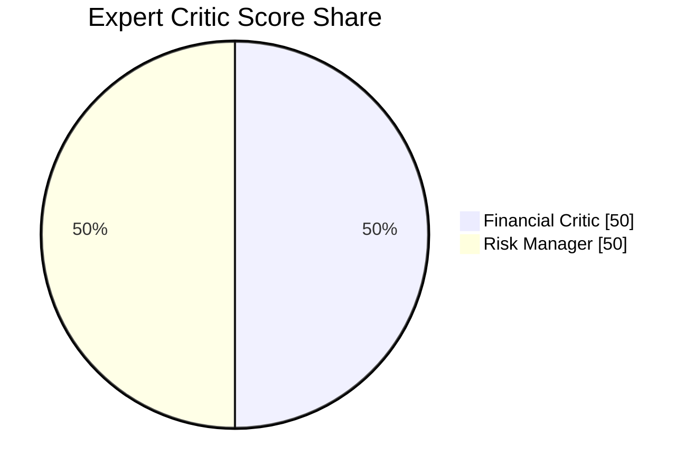

# Sample Market Analysis Report

> This reviewer artifact shows the expected structure of a generated course-project report. Runtime reports are produced by `Report Compiler` into `output/` and are ignored by git.

## Executive Summary

Agentic AI developer tooling is moving from autocomplete toward supervised work execution: coding agents can inspect repositories, plan edits, run commands and summarize changes, while IDE copilots remain the lowest-friction adoption path. For a small AEC/manufacturing software team, the practical recommendation is not immediate autonomous delivery. The safer roadmap is staged adoption: individual IDE assistance, read-only knowledge access, bounded coding-agent pilots, observability/evaluation, then guarded workflow integration.

## Market Segments

- **IDE copilots and AI-native editors:** useful for everyday completion, explanation and local refactoring support.
- **Agentic coding tools:** useful for bounded multi-file tasks, test repair, migration support and documentation-heavy maintenance.
- **Observability and evaluation platforms:** needed once agent outputs influence team workflow, code quality or operational decisions.
- **MCP-based integrations:** useful as reusable read-only bridges to docs, RAG, internal tools and workflow context.

## Expert Critic Summary

- **Financial Critic:** adoption should distinguish seat licenses, API usage, observability costs and integration time.
- **Risk Manager:** write actions need human review, rollback paths and measurable pilot boundaries.
- **AI-Suggested or Custom Critic:** optional extra critic roles can be added for freshness, compliance, procurement, domain fit or market timing.

## Recommended Roadmap

1. Start with IDE copilots and AI-native editors for individual developer productivity.
2. Add public/internal knowledge RAG and read-only MCP tools.
3. Pilot coding agents on bounded maintenance tasks with mandatory diff review.
4. Add Langfuse traces, prompt management and LLM-as-a-Judge checks.
5. Expand only when the team can measure quality, cost and review-time improvements.

## Mermaid Decision Diagrams

### Market Entry Decision Flow

### Payback Decision Gate

### Market Validation Timeline

### Market Saturation Map

### Expert Critic Score Share

## Sources

Runtime reports include public URLs and local RAG source references gathered during the run.
