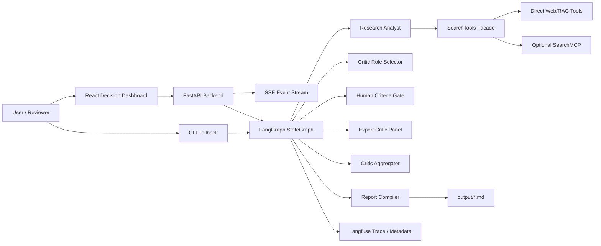
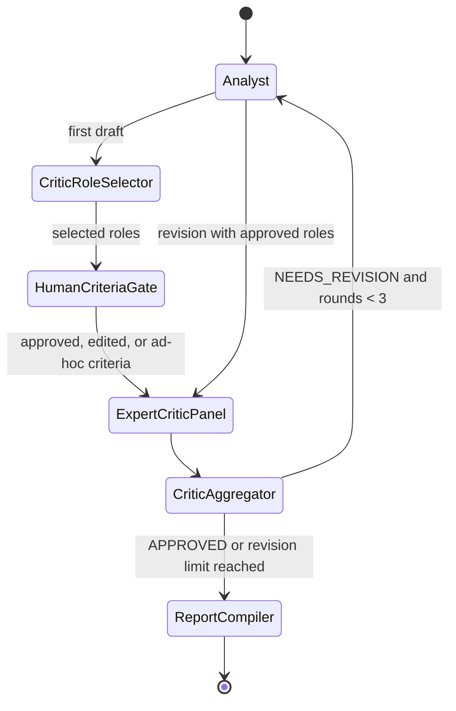
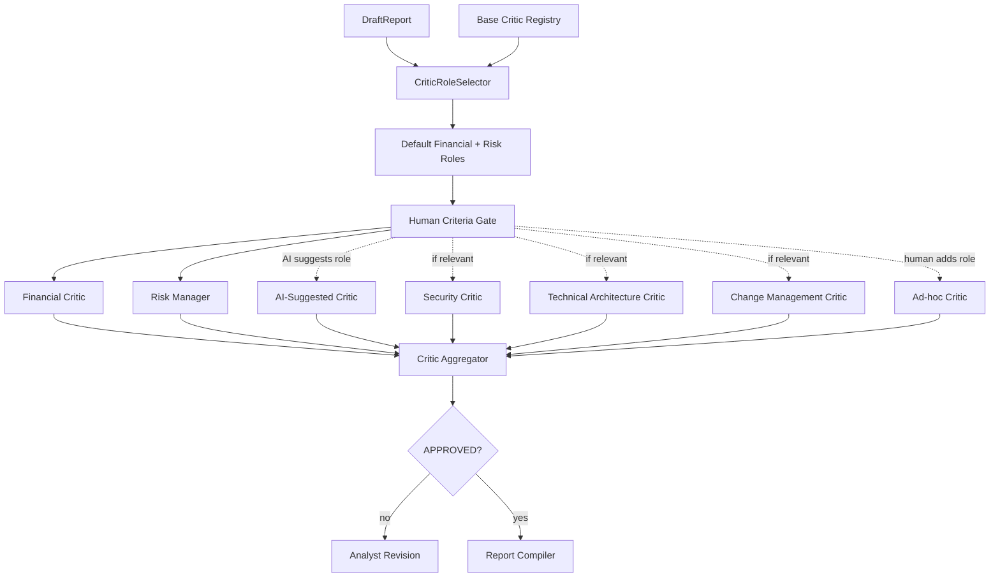
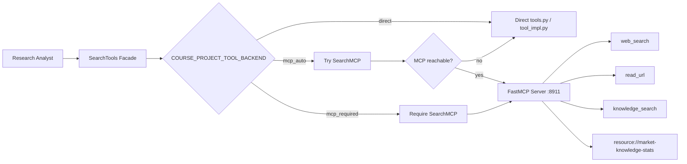
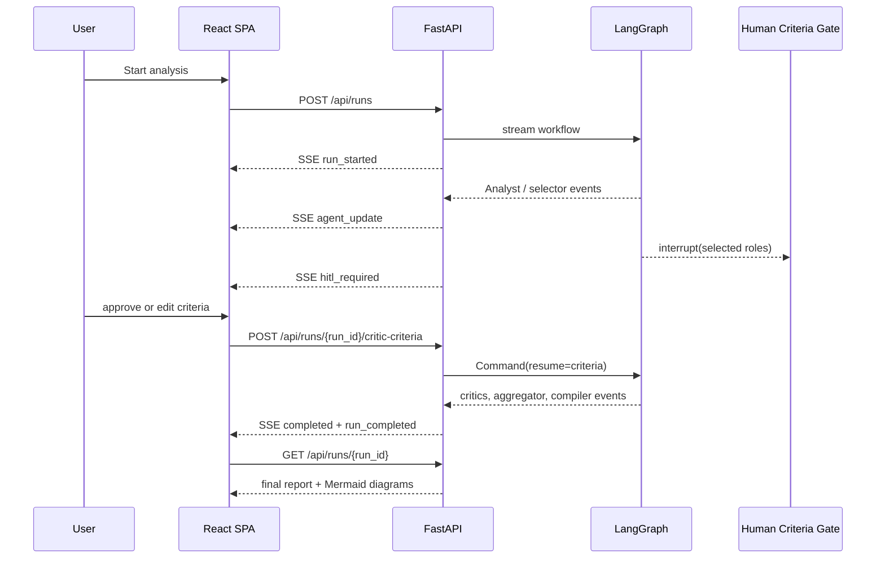
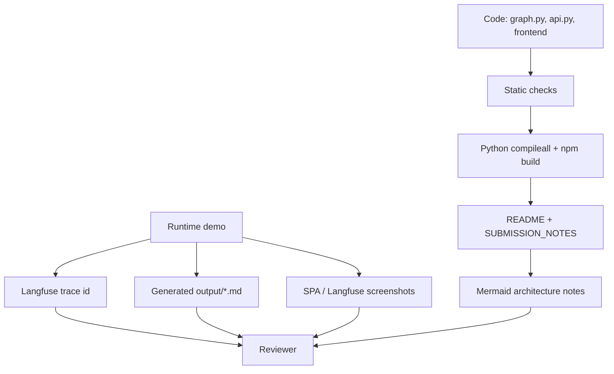

# Mermaid Діаграми: Course Project Market Analyst

Ці діаграми описують фактичну реалізацію фінального проєкту для перевірки source-level архітектури. У live report `Report Compiler` генерує інші Mermaid artifacts: market entry flow, payback gate, validation timeline, saturation map і pie chart з розподілом оцінок expert critics.

## 1. Загальна Архітектура

## 2. LangGraph Workflow

## 3. Expert Critic Panel

## 4. Optional MCP Boundary

## 5. SPA And SSE Runtime

## 6. Reviewer Evidence Flow

