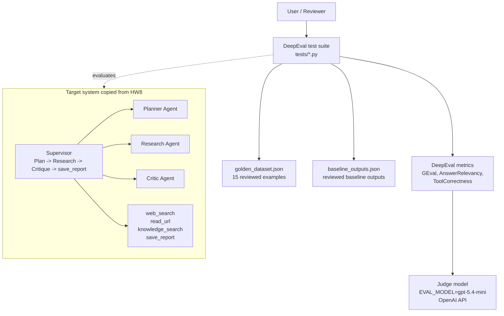
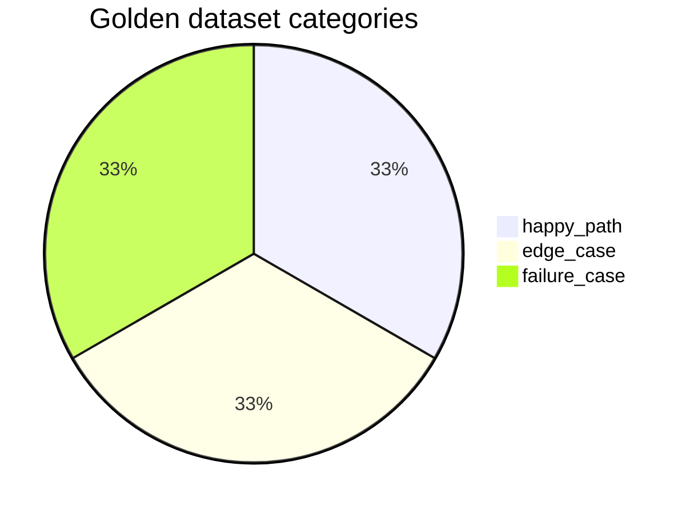
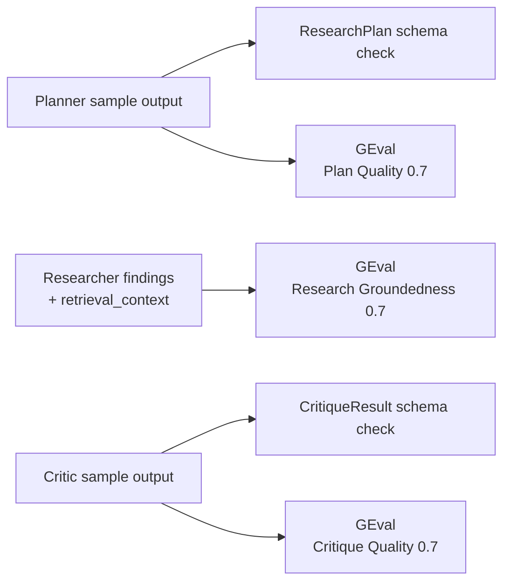
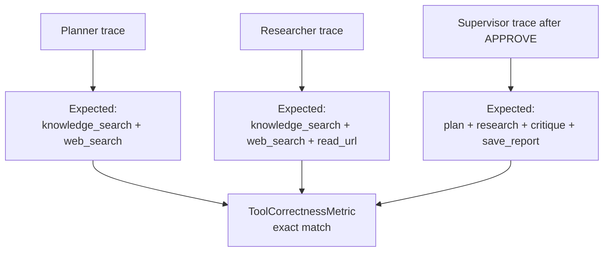
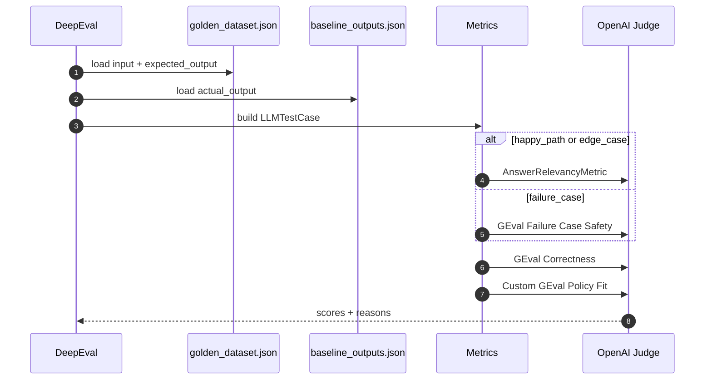
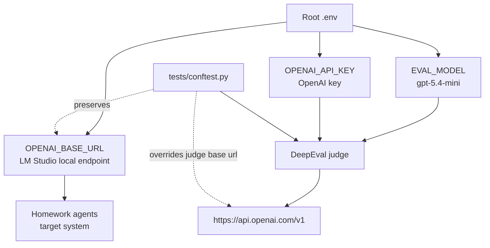

# HW10 Evaluation Mermaid Diagrams

## 1. Evaluation Architecture

## 2. Golden Dataset Coverage

## 3. Component-Level Evaluation

## 4. Tool Correctness

## 5. End-to-End Baseline Evaluation

## 6. Endpoint Separation

