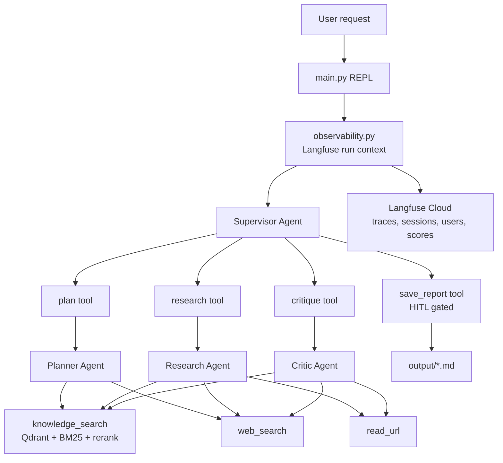
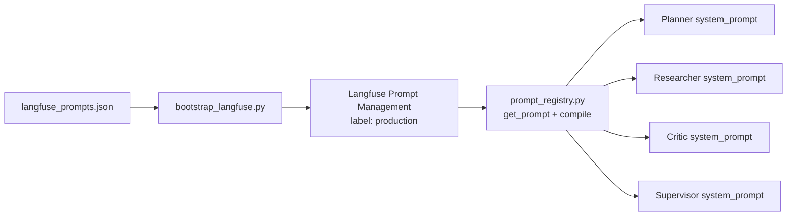
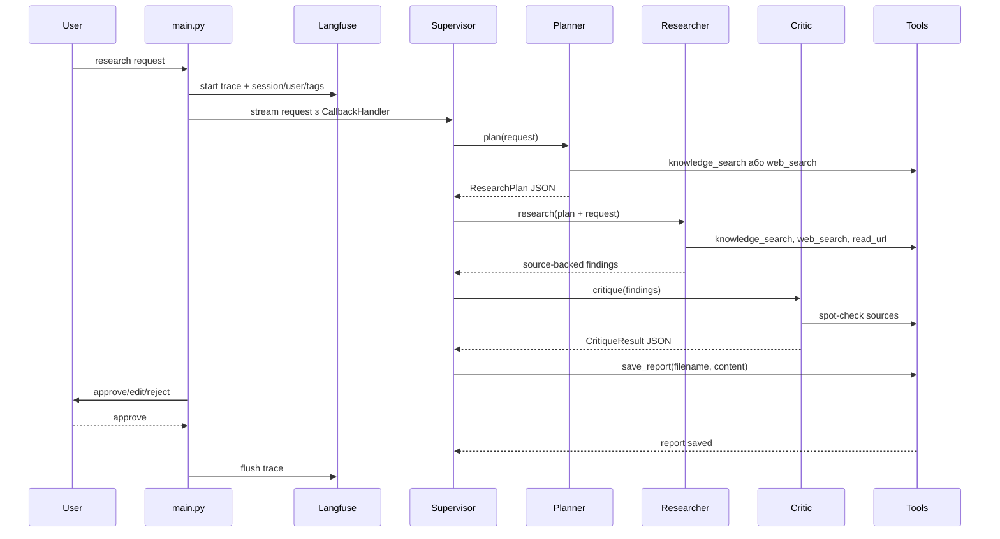
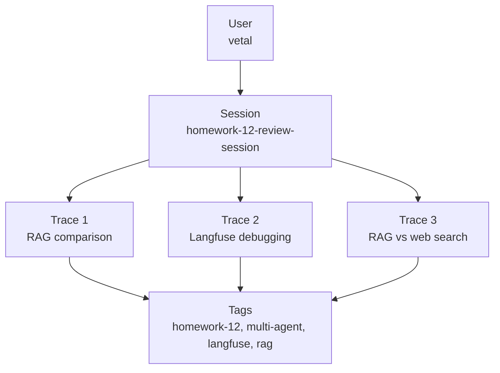
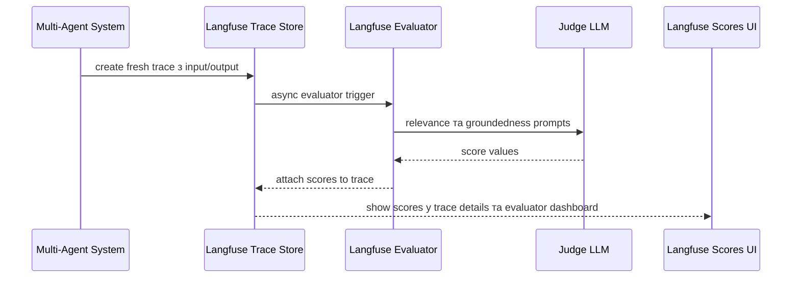
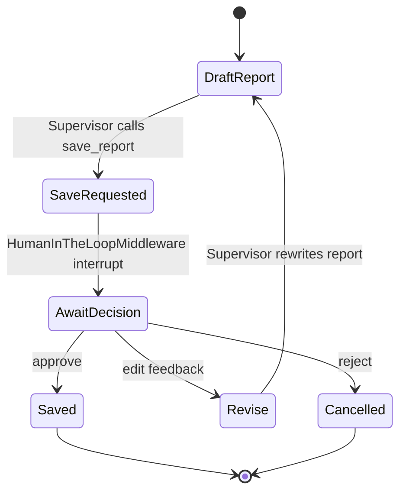

# HW12 Langfuse Mermaid Діаграми

## 1. Архітектура

```mermaid
flowchart TB
    User["User request"] --> Main["main.py REPL"]
    Main --> Obs["observability.py<br/>Langfuse run context"]
    Obs --> Supervisor["Supervisor Agent"]

    Supervisor --> PlannerTool["plan tool"]
    Supervisor --> ResearchTool["research tool"]
    Supervisor --> CriticTool["critique tool"]
    Supervisor --> SaveTool["save_report tool<br/>HITL gated"]

    PlannerTool --> Planner["Planner Agent"]
    ResearchTool --> Researcher["Research Agent"]
    CriticTool --> Critic["Critic Agent"]

    Planner --> RAG["knowledge_search<br/>Qdrant + BM25 + rerank"]
    Planner --> Web["web_search"]
    Researcher --> RAG
    Researcher --> Web
    Researcher --> ReadURL["read_url"]
    Critic --> RAG
    Critic --> Web
    Critic --> ReadURL

    Obs --> Langfuse["Langfuse Cloud<br/>traces, sessions, users, scores"]
    SaveTool --> Output["output/*.md"]
```

## 2. Prompt Management

```mermaid
flowchart LR
    Seed["langfuse_prompts.json"] --> Bootstrap["bootstrap_langfuse.py"]
    Bootstrap --> PromptUI["Langfuse Prompt Management<br/>label: production"]
    PromptUI --> Registry["prompt_registry.py<br/>get_prompt + compile"]
    Registry --> Planner["Planner system_prompt"]
    Registry --> Researcher["Researcher system_prompt"]
    Registry --> Critic["Critic system_prompt"]
    Registry --> Supervisor["Supervisor system_prompt"]
```

## 3. Runtime Послідовність

```mermaid
sequenceDiagram
    participant U as User
    participant M as main.py
    participant L as Langfuse
    participant S as Supervisor
    participant P as Planner
    participant R as Researcher
    participant C as Critic
    participant T as Tools

    U->>M: research request
    M->>L: start trace + session/user/tags
    M->>S: stream request з CallbackHandler
    S->>P: plan(request)
    P->>T: knowledge_search або web_search
    P-->>S: ResearchPlan JSON
    S->>R: research(plan + request)
    R->>T: knowledge_search, web_search, read_url
    R-->>S: source-backed findings
    S->>C: critique(findings)
    C->>T: spot-check sources
    C-->>S: CritiqueResult JSON
    S->>T: save_report(filename, content)
    M->>U: approve/edit/reject
    U-->>M: approve
    T-->>S: report saved
    M->>L: flush trace
```

## 4. Session Та User Tracking

```mermaid
flowchart TB
    Session["Session<br/>homework-12-review-session"] --> Trace1["Trace 1<br/>RAG comparison"]
    Session --> Trace2["Trace 2<br/>Langfuse debugging"]
    Session --> Trace3["Trace 3<br/>RAG vs web search"]
    User["User<br/>vetal"] --> Session
    Trace1 --> Tags["Tags<br/>homework-12, multi-agent, langfuse, rag"]
    Trace2 --> Tags
    Trace3 --> Tags
```

## 5. LLM-As-A-Judge Flow

```mermaid
sequenceDiagram
    participant MAS as Multi-Agent System
    participant LF as Langfuse Trace Store
    participant Eval as Langfuse Evaluator
    participant Judge as Judge LLM
    participant UI as Langfuse Scores UI

    MAS->>LF: create fresh trace з input/output
    LF->>Eval: async evaluator trigger
    Eval->>Judge: relevance та groundedness prompts
    Judge-->>Eval: score values
    Eval-->>LF: attach scores to trace
    LF-->>UI: show scores у trace details та evaluator dashboard
```

## 6. HITL Save Flow

```mermaid
stateDiagram-v2
    [*] --> DraftReport
    DraftReport --> SaveRequested: Supervisor calls save_report
    SaveRequested --> AwaitDecision: HumanInTheLoopMiddleware interrupt
    AwaitDecision --> Saved: approve
    AwaitDecision --> Revise: edit feedback
    AwaitDecision --> Cancelled: reject
    Revise --> DraftReport: Supervisor rewrites report
    Saved --> [*]
    Cancelled --> [*]
```
