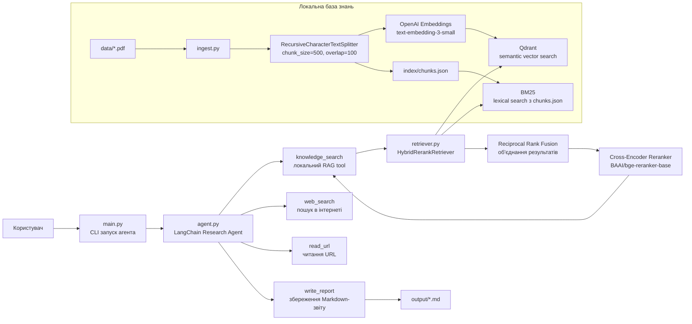
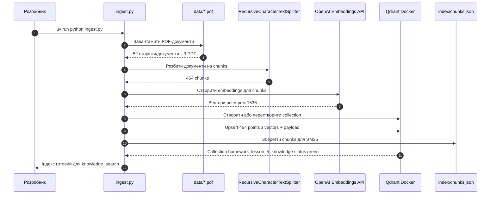
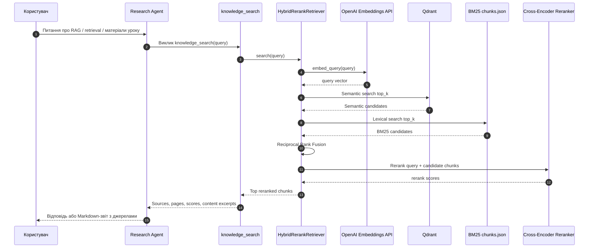
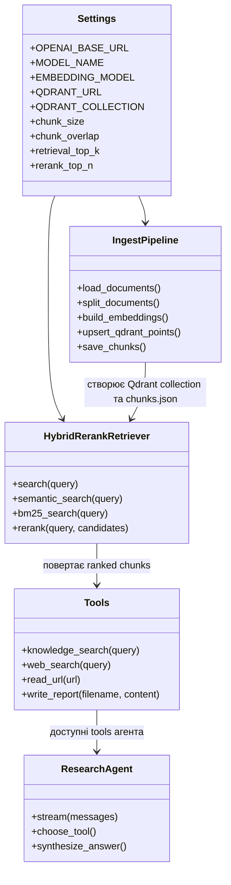
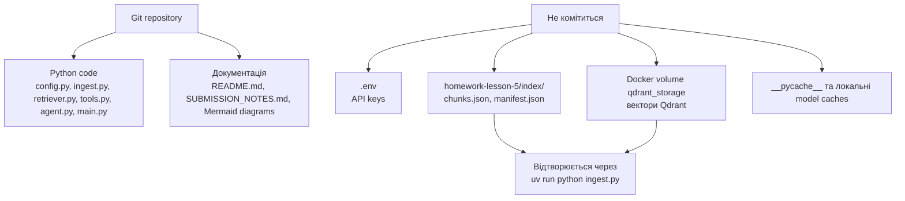

# UML / Mermaid діаграми RAG-системи

## 1. Загальна архітектура

```mermaid
flowchart LR
    User["Користувач"] --> CLI["main.py<br/>CLI запуск агента"]
    CLI --> Agent["agent.py<br/>LangChain Research Agent"]

    Agent --> KnowledgeTool["knowledge_search<br/>локальний RAG tool"]
    Agent --> WebSearch["web_search<br/>пошук в інтернеті"]
    Agent --> ReadUrl["read_url<br/>читання URL"]
    Agent --> WriteReport["write_report<br/>збереження Markdown-звіту"]

    KnowledgeTool --> Retriever["retriever.py<br/>HybridRerankRetriever"]
    Retriever --> Qdrant["Qdrant<br/>semantic vector search"]
    Retriever --> BM25["BM25<br/>lexical search з chunks.json"]
    Retriever --> RRF["Reciprocal Rank Fusion<br/>об'єднання результатів"]
    RRF --> Reranker["Cross-Encoder Reranker<br/>BAAI/bge-reranker-base"]
    Reranker --> KnowledgeTool

    WriteReport --> Output["output/*.md"]

    subgraph LocalKnowledge["Локальна база знань"]
        Data["data/*.pdf"] --> Ingest["ingest.py"]
        Ingest --> Chunking["RecursiveCharacterTextSplitter<br/>chunk_size=500, overlap=100"]
        Chunking --> Embeddings["OpenAI Embeddings<br/>text-embedding-3-small"]
        Embeddings --> Qdrant
        Chunking --> ChunksJson["index/chunks.json"]
        ChunksJson --> BM25
    end
```

## 2. Ingestion pipeline

```mermaid
sequenceDiagram
    autonumber
    participant Dev as Розробник
    participant Ingest as ingest.py
    participant Data as data/*.pdf
    participant Splitter as RecursiveCharacterTextSplitter
    participant OpenAI as OpenAI Embeddings API
    participant Qdrant as Qdrant Docker
    participant Index as index/chunks.json

    Dev->>Ingest: uv run python ingest.py
    Ingest->>Data: Завантажити PDF-документи
    Data-->>Ingest: 52 сторінки/документи з 3 PDF
    Ingest->>Splitter: Розбити документи на chunks
    Splitter-->>Ingest: 464 chunks
    Ingest->>OpenAI: Створити embeddings для chunks
    OpenAI-->>Ingest: Вектори розміром 1536
    Ingest->>Qdrant: Створити або перестворити collection
    Ingest->>Qdrant: Upsert 464 points з vectors + payload
    Ingest->>Index: Зберегти chunks для BM25
    Qdrant-->>Ingest: Collection homework_lesson_5_knowledge status green
    Ingest-->>Dev: Індекс готовий для knowledge_search
```

## 3. Query pipeline агента

```mermaid
sequenceDiagram
    autonumber
    participant User as Користувач
    participant Agent as Research Agent
    participant Tool as knowledge_search
    participant Retriever as HybridRerankRetriever
    participant OpenAI as OpenAI Embeddings API
    participant Qdrant as Qdrant
    participant BM25 as BM25 chunks.json
    participant Reranker as Cross-Encoder Reranker

    User->>Agent: Питання про RAG / retrieval / матеріали уроку
    Agent->>Tool: Виклик knowledge_search(query)
    Tool->>Retriever: search(query)
    Retriever->>OpenAI: embed_query(query)
    OpenAI-->>Retriever: query vector
    Retriever->>Qdrant: Semantic search top_k
    Qdrant-->>Retriever: Semantic candidates
    Retriever->>BM25: Lexical search top_k
    BM25-->>Retriever: BM25 candidates
    Retriever->>Retriever: Reciprocal Rank Fusion
    Retriever->>Reranker: Rerank query + candidate chunks
    Reranker-->>Retriever: rerank scores
    Retriever-->>Tool: Top reranked chunks
    Tool-->>Agent: Sources, pages, scores, content excerpts
    Agent-->>User: Відповідь або Markdown-звіт з джерелами
```

## 4. Компоненти та відповідальність

```mermaid
classDiagram
    class Settings {
        +OPENAI_BASE_URL
        +MODEL_NAME
        +EMBEDDING_MODEL
        +QDRANT_URL
        +QDRANT_COLLECTION
        +chunk_size
        +chunk_overlap
        +retrieval_top_k
        +rerank_top_n
    }

    class IngestPipeline {
        +load_documents()
        +split_documents()
        +build_embeddings()
        +upsert_qdrant_points()
        +save_chunks()
    }

    class HybridRerankRetriever {
        +search(query)
        +semantic_search(query)
        +bm25_search(query)
        +rerank(query, candidates)
    }

    class Tools {
        +knowledge_search(query)
        +web_search(query)
        +read_url(url)
        +write_report(filename, content)
    }

    class ResearchAgent {
        +stream(messages)
        +choose_tool()
        +synthesize_answer()
    }

    Settings --> IngestPipeline
    Settings --> HybridRerankRetriever
    IngestPipeline --> HybridRerankRetriever : створює Qdrant collection та chunks.json
    HybridRerankRetriever --> Tools : повертає ranked chunks
    Tools --> ResearchAgent : доступні tools агента
```

## 5. Що не потрапляє в Git

```mermaid
flowchart TD
    Git["Git repository"] --> Code["Python code<br/>config.py, ingest.py, retriever.py, tools.py, agent.py, main.py"]
    Git --> Docs["Документація<br/>README.md, SUBMISSION_NOTES.md, Mermaid diagrams"]

    NotGit["Не комітиться"] --> Env[".env<br/>API keys"]
    NotGit --> QdrantVolume["Docker volume qdrant_storage<br/>вектори Qdrant"]
    NotGit --> LocalIndex["homework-lesson-5/index/<br/>chunks.json, manifest.json"]
    NotGit --> Cache["__pycache__ та локальні model caches"]

    LocalIndex --> Recreate["Відтворюється через<br/>uv run python ingest.py"]
    QdrantVolume --> Recreate
```

