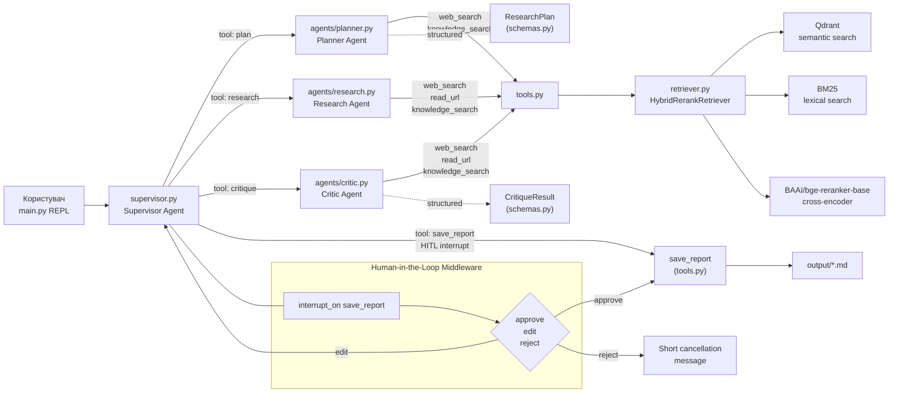
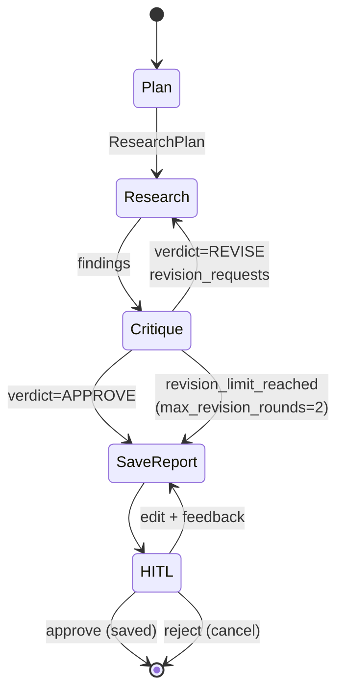
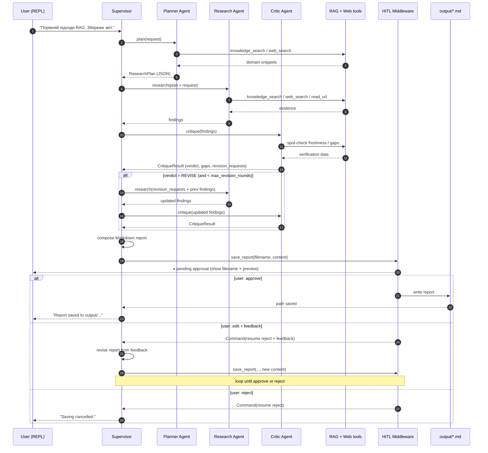
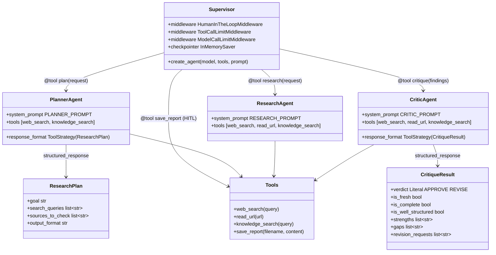
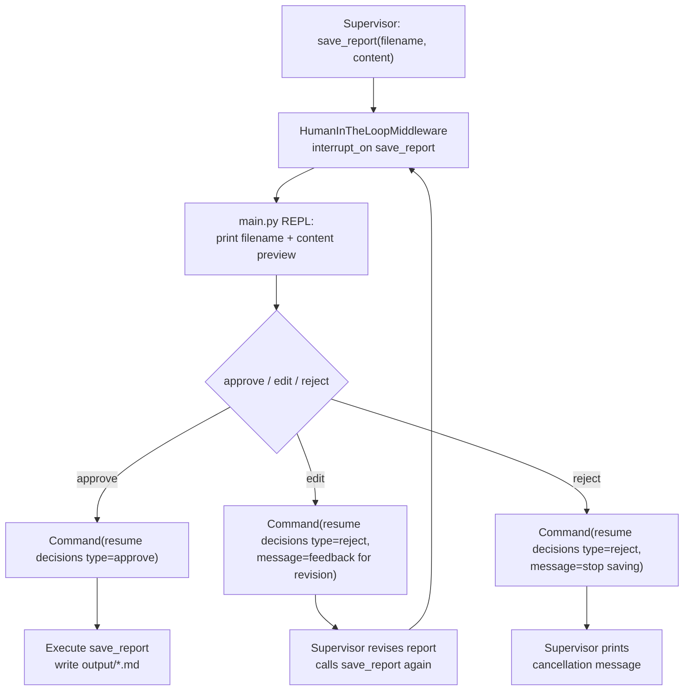

# UML / Mermaid діаграми мультиагентної системи (homework lesson 8)

## 1. Загальна архітектура: Plan → Research → Critique → Report

## 2. Evaluator–Optimizer loop (research ↔ critic)

## 3. Повний sequence-flow одного запиту

## 4. Agent-as-tool композиція

## 5. HITL резюмування рішень користувача

Ця діаграма показує canonical path ДЗ: запис проходить через `save_report` і HITL-рішення користувача. Прямий fallback-запис з `main.py` навмисно не включено в основну діаграму, бо це last-resort виняток для слабких локальних моделей або середовища без бюджету на сильнішу модель, а не штатна оркестрація Supervisor.

## 6. Що комітиться в Git і що треба відтворити локально

Мапа для перевіряючого: ліва гілка — все, що приходить з клоном репо і достатньо для ревʼю; права гілка — локальні артефакти, які перевіряючому треба згенерувати самостійно (і як саме). Відповідає фактичному стану `git ls-files` + `git check-ignore` проти кореневого `.gitignore`.

```mermaid
flowchart TD
    Git["Git repository"] --> Code["Python код<br/>config.py, supervisor.py, agents/*, tools.py,<br/>retriever.py, ingest.py, schemas.py, main.py"]
    Git --> Docs["Документація<br/>README.md, SUBMISSION_NOTES.md,<br/>uml_diagrams/MULTI_AGENT_MERMAID.md"]
    Git --> Deps["requirements.txt"]
    Git --> DataPdfs["data/*.pdf<br/>вхідні PDF для RAG"]
    Git --> SampleReports["tracked output/*.md<br/>4 reviewer sample reports"]

    NotGit["Не комітиться"] --> Env[".env / .env.*<br/>API keys, MODEL_NAME, REQUEST_TIMEOUT"]
    NotGit --> QdrantVolume["Docker volume qdrant_storage<br/>вектори Qdrant (живе поза repo)"]
    NotGit --> LocalIndex["homework-lesson-8/index/<br/>chunks.json, manifest.json<br/>правило: homework-lesson-*/index/"]
    NotGit --> OutputDir["нові homework-lesson-8/output/*.md<br/>локальні згенеровані звіти<br/>правило: homework-lesson-*/output/"]
    NotGit --> Resources["homework-lesson-8/resources/<br/>лекційний notebook, посилання<br/>правило: resources"]
    NotGit --> Cache["__pycache__/ + HF/transformers cache<br/>(cross-encoder)"]
    NotGit --> Venv[".venv/"]
    NotGit --> IDE[".idea/, .vscode/"]

    LocalIndex --> Recreate["Відтворюється через<br/>uv run python ingest.py"]
    QdrantVolume --> Recreate
    OutputDir --> Recreate2["Відтворюється через<br/>uv run python main.py<br/>(і HITL approve)"]
```

