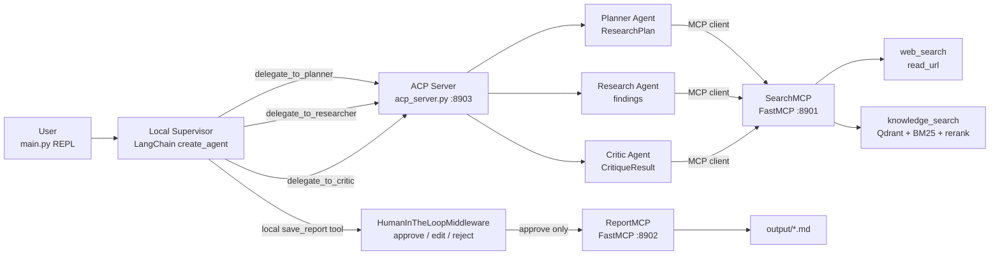
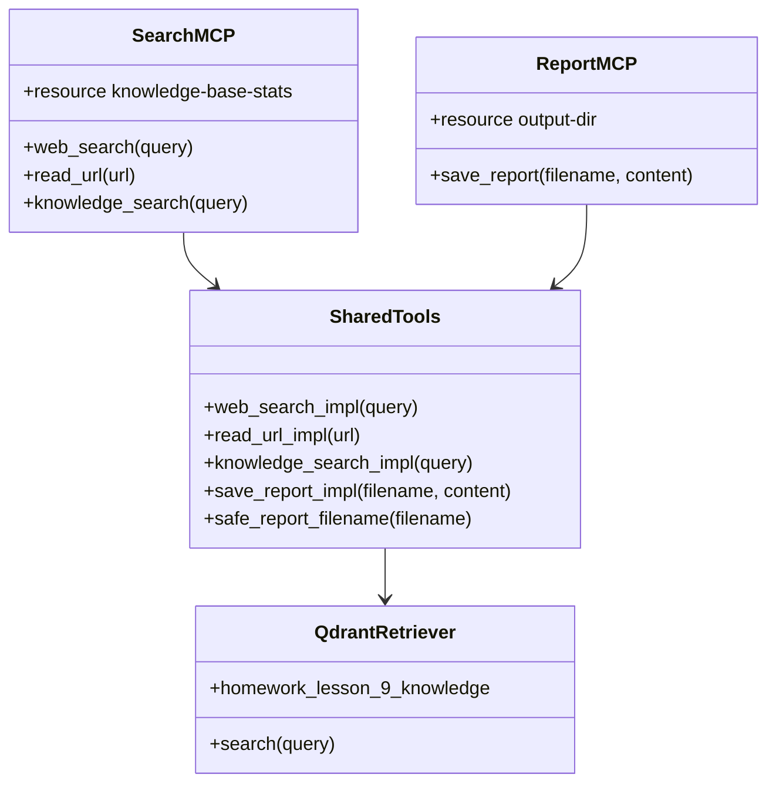
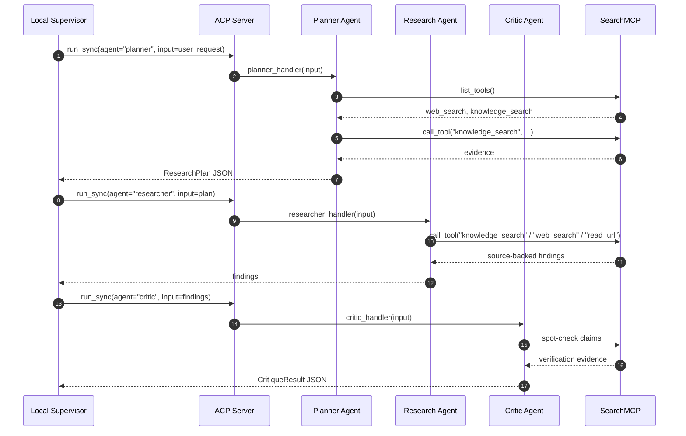
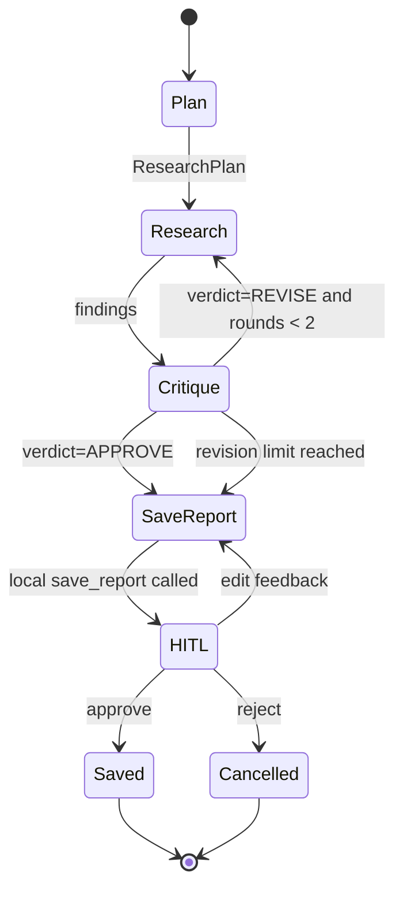
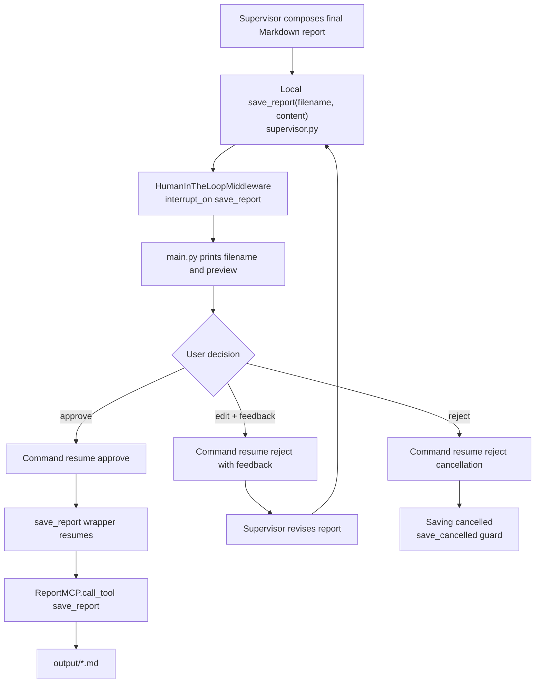
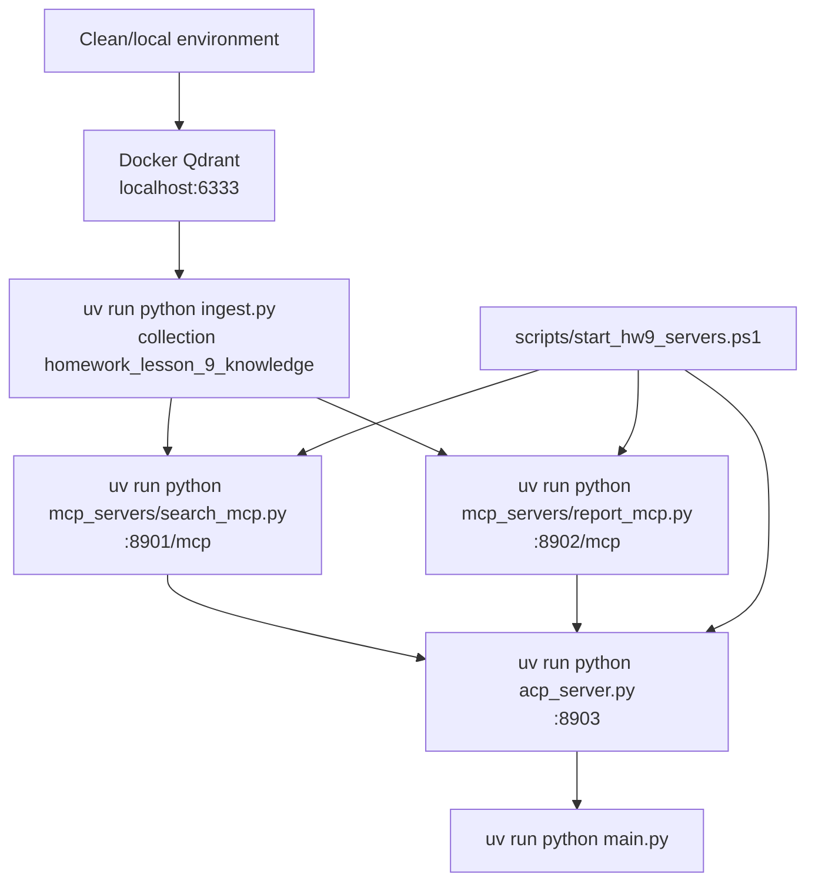
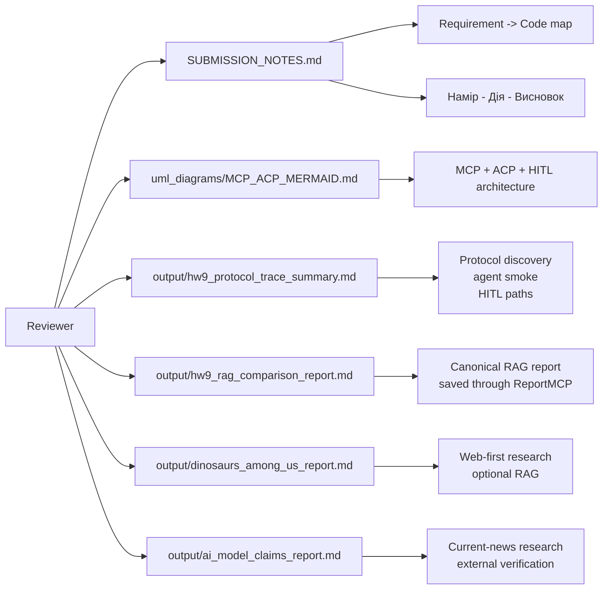

# UML / Mermaid діаграми MCP + ACP системи (homework lesson 9)

## 1. Загальна архітектура

## 2. MCP Tools And Resources

## 3. ACP Agent Delegation

## 4. End-To-End Workflow

## 5. HITL Save Through ReportMCP

## 6. Startup And Runtime Map

## 7. Reviewer Evidence Map

